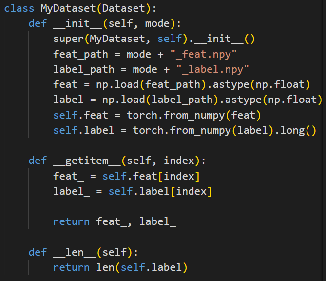

# AI Lab1

​											  							   徐海阳 PB20000326

## 实验环境

机器设备情况：RTX3090 x 1

所用语言：Python

库：torch, numpy, sklearn + python=3.9 anaconda自带

## 数据预处理及读取

### MLP

读取.csv文件并存入.npy文件

定义Dataset

### SVM

尝试了在整个数据集上进行训练，速度极慢。于是将数据集随机选出1/100作为新的数据集。也就是trainset 7k样本，validset 7k样本，testset 1k样本。记为"small_{}"feat/label,{}=train, validation, test

取1/100的代码：

##  训练过程

### 主要函数

#### MLP

1. init dataset和model

2. train

3. eval

#### SVM

### 训练及调参过程

#### MLP2

1. 第一次实验超参数：

    batch_size: 1024, learning_rate: 0.50, max_epoch: 5, activator: sigmoid, layer_list: [285, 16, 2]

2. 第一次实验结果：

    

3. 结果分析及超参数选择：

    train和eval都逐渐收敛
    但F1 score和accuracy都存在一定抖动，同时F1 score和accuracy无法到达很高的数值
    因此存在问题：无法收敛到最优的点
    针对这种情况，采取以下超参数调整办法：

    1. 适当降低lr，如0.5->0.4
    2. 增大某些层神经元数量，让网络学到更多、更细致的特征，利于提高F1 score

4. 第二次实验超参数：

    batch_size: 1024, learning_rate: 0.40, max_epoch: 5, activator: sigmoid, layer_list: [285, 32, 2]

5. 第二次实验结果：

    
    
    稳定性和F1 score都有一定提升
    
    选择第二次实验的模型在test集上进行测试

#### MLP3

1. 第一次实验超参数：

    batch_size: 1024, learning_rate: 0.50, max_epoch: 5, activator: sigmoid, layer_list: [285, 64, 8, 2]

2. 第一次实验结果：

    

3. 结果分析及超参数选择：

    train和eval都逐渐收敛
    但F1 score和accuracy都存在一定抖动
    因此存在问题：无法收敛到最优的点
    针对这种情况，采取以下超参数调整办法：

    1. 适当降低lr，如0.5->0.3
    2. 适当减小batchszie，防止bsz大、lr小从而导致收敛到局部最优
    3. 增大某些层神经元数量，让网络学到更多、更细致的特征，利于提高F1 score

4. 第二次实验超参数：

    batch_size: 512, learning_rate: 0.30, max_epoch: 5, activator: sigmoid, layer_list: [285, 128, 16, 2]

5. 第二次实验结果：

    
    
    F1 score最大值超过了第一次试验，但稳定性没有提升。
    
    选择第二次实验的模型在test集上进行测试。

#### MLP4

1. 第一次实验超参数：

    batch_size: 1024, learning_rate: 0.50, max_epoch: 5, activator: sigmoid, layer_list: [285, 128, 64, 8, 2]

2. 第一次实验结果：

    

3. 结果分析及超参数选择：

    F1 score始终有较大的抖动，甚至经常出现0

    同时accuary也存在抖动。直到epoch4之后，F1 score和accuracy才上到一个较高的数值
    因此存在问题有：

    1. lr太大，导致前期一直没有学习到什么，后期也存在一定抖动
    2.  2.存在几次F1 score为0的情况，说明存在较严重的过拟合现象

    针对这种情况，采取以下超参数调整办法：

    1. 适当降低lr，如0.5->0.3 
    2. 适当增大batchszie，避免出现学到某个batch的局部特征，从而导致F1骤降的情况发生 
    3. 将激活函数换为relu,降低过拟合现象 
    4. 减小某些层神经元数量，目的是让网络学到更精炼、更高层的特征，提高泛化性，避免学到某些层特征时导致F1骤降的情况发生

4. 第二次实验超参数：

    batch_size: 512, learning_rate: 0.30, max_epoch: 5, activator: sigmoid, layer_list: [285, 128, 16, 2]

5. 第二次实验结果：

    
    
    稳定性提升明显。F1 score没有明显提升，与上一次实验持平。
    
    选择第二次实验的模型在test集上进行测试

#### SVM

##### kernal = rbf

可以看到，软间隔c=1时，train和epoch的F1 score较为接近；调为1000，过拟合；调为500，仍过拟合；调为100，效果略有上升；调为50，持平；调为150，过拟合

选择c=100作为候选

##### kernal = linear

软间隔c=1时，train和epoch的F1 score较为接近；调为100，持平

F1 score低于“kernal = rbf， c = 100”的模型

##### kernal = poly

一阵狂调，皆失败...

最终选择“kernal = rbf， c = 100”的模型在test集上进行测试

### 测试及分析

#### 拟合情况及特点

#### F1 score，ROC，AUC分析

