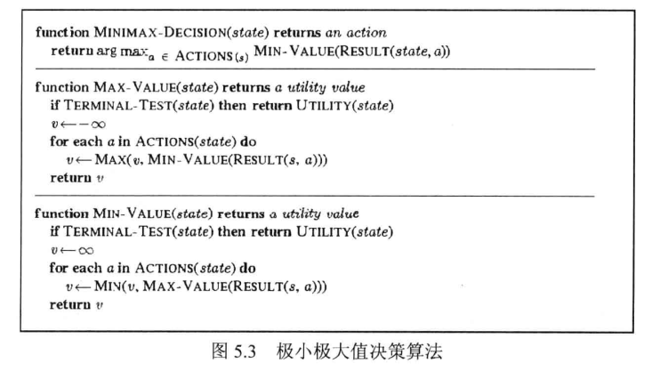
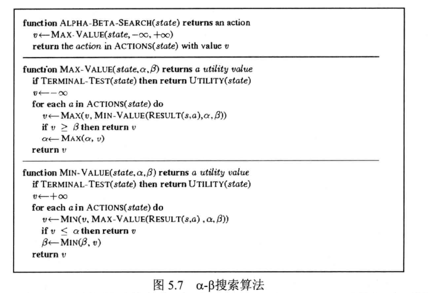
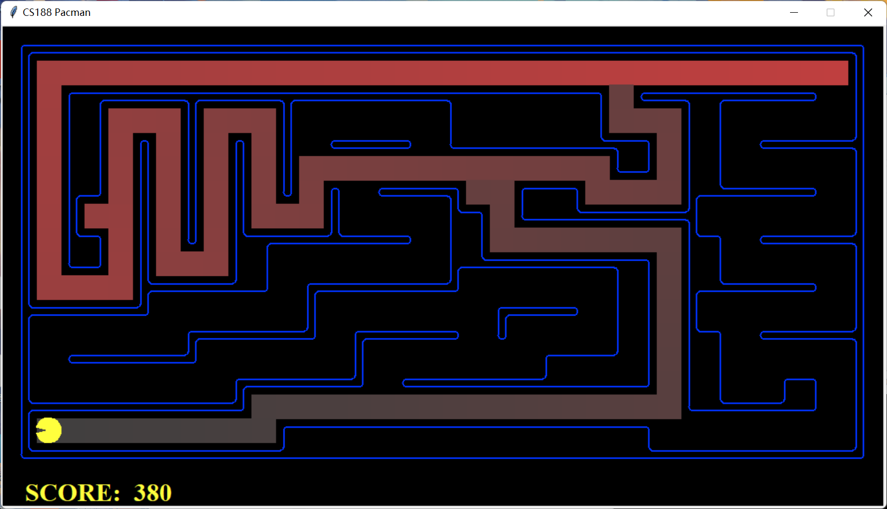
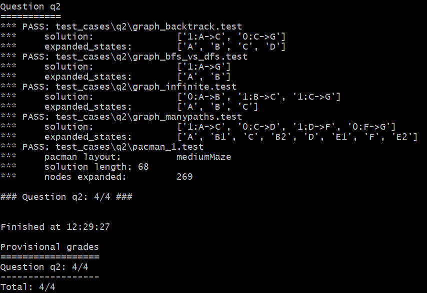
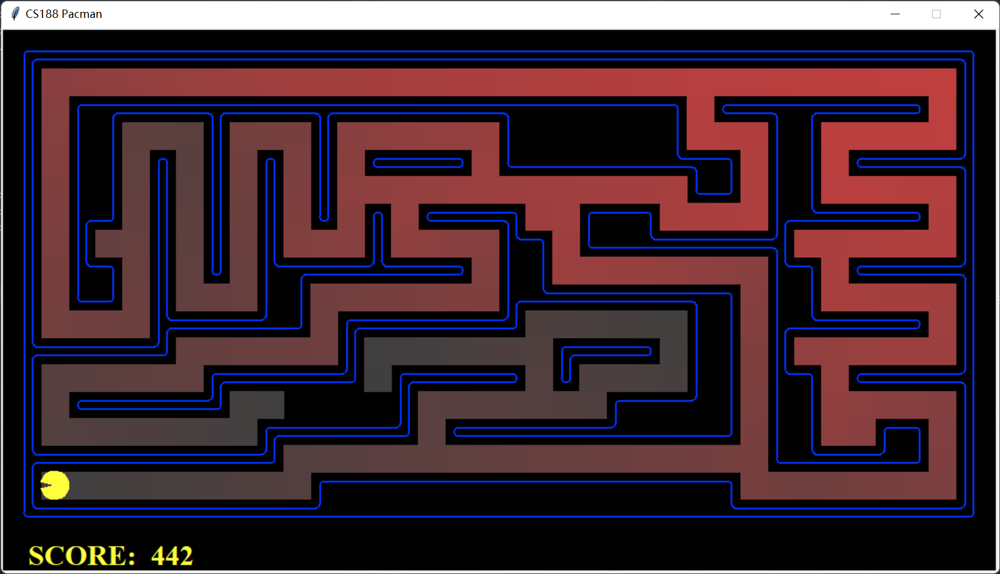
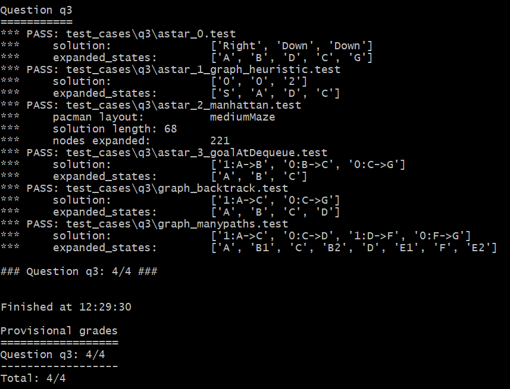
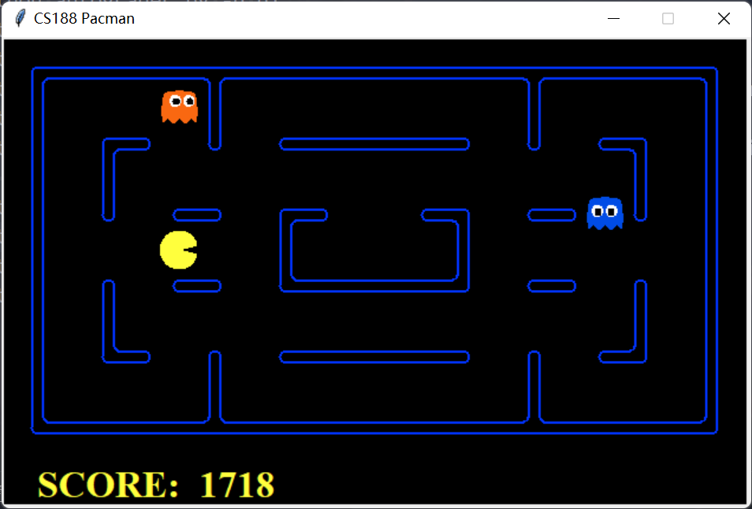
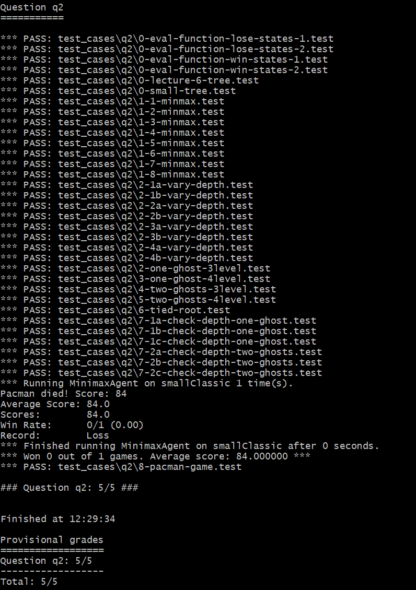
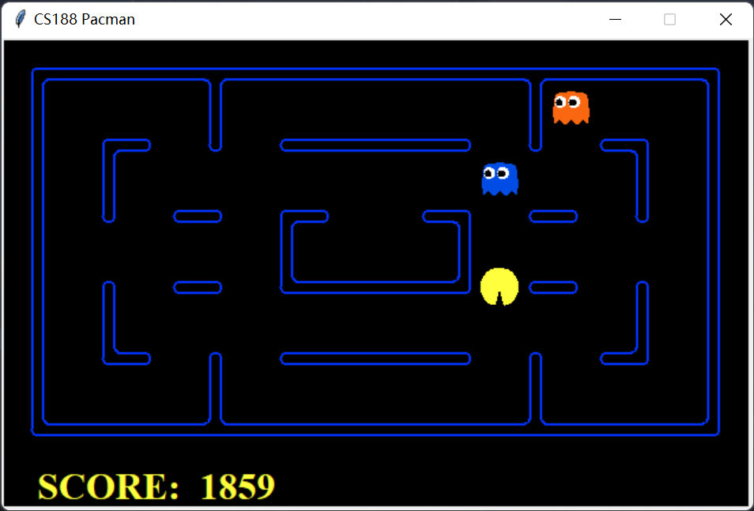
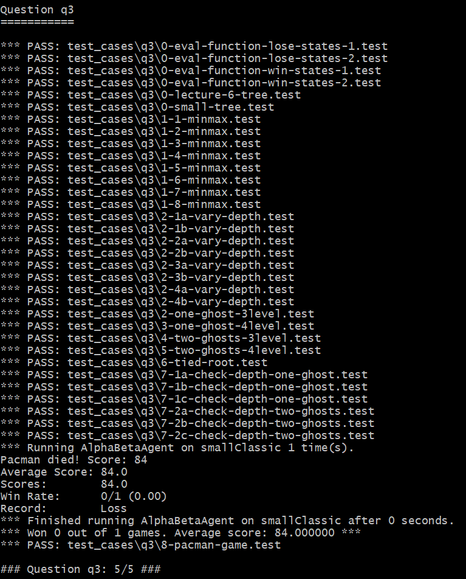

# AI LAB2 实验报告

## 一、算法实现思路

### 1. BFS

和助教实现的DFS思路相同，不同之处是将存放待访问节点的数据结构改为从队列改成栈。具体实现逻辑：

1. 根节点入栈
2. 栈顶元素（第一步就是根节点）出栈，将它的children都入栈
3. 不断执行(2)，直到栈为空（本实验中在栈空之前一定能够到达终点，故用 $problem.isGoalState()$ 来判断终止条件）
4. 将出栈的元素按顺序输出即为solution

### 2. Astar

和BFS的思路相同，不同之处是将栈改为优先队列。优先队列的优先级别由 $newcost + heuristic(nextstate)$ 来决定。具体实现逻辑：

1. 根节点入优先队列
2. 优先队列优先级别最高者$S_n$（第一步就是根节点）出队，将它的children $S_{n+1}$入队，children的优先级别为$cost(S_n,S_{n+1}) + heuristic(S_{n+1})$
3. 不断执行(2)，直到优先队列为空（本实验中在优先队列空之前一定能够到达终点，故用 $problem.isGoalState()$ 来判断终止条件）
4. 将出队元素按顺序输出即为solution

### 3. MinMax

书上的朴素版思路：

在此基础上，本实验需要做**2**个改进：

1. 除了best_score，我们还需要输出best_state

实现思路：

在更新v(best_score)时一并更新best_state，也就是将child赋给best_state

2. 我们用depth来控制决策树的生成深度

实现思路：

根据实验文档，depth是对于每个agent而言的。由于第一个行动的是人，因此，状态从人到鬼depth不变，状态从鬼到人depth-1。终止条件为$state.isTerminated() == True$ 或者 depth == 0

### 4. AlphaBeta

书上的朴素版思路：

在此基础上，本实验需要做**3**个改进：

1. 除了best_score，我们还需要输出best_state

实现思路：

在更新v(best_score)时一并更新best_state，也就是将child赋给best_state

2. 我们用depth来控制决策树的生成深度

实现思路：

根据实验文档，depth是对于每个agent而言的。由于第一个行动的是人，因此，状态从人到鬼depth不变，状态从鬼到人depth-1。终止条件为$state.isTerminated() == True$ 或者 depth == 0

3. 剪枝条件的更改

实现思路：

当按照原条件，也就是 $v >= \beta$ 时进行剪枝，会发现测试样例 6-tied-root 无法通过。分析得出应该将剪枝条件修改为$v > \beta$。 同理将 $v <= \alpha$ 改为 $v < \alpha$

## 二、算法测试截图

### 1. BFS

### 2. Astar

### 3. MinMax

### 4. AlphaBeta

## Somthing want to say

感谢两位助教！

无论是作业问题（我记得那个bp算法找过王佳禾助教两三次），还是考前复习（有几处疑问得到了梁聪助教的立刻回复），抑或是presentation的修改建议和评语（梁聪助教的建议帮助很大），还是本次实验（两位助教都打扰了），助教们的回复都很积极及时而且很有东西（指能够简洁有效地解决我的问题）。

谢谢两位助教！祝两位助教paper ++！这门课程的助教体验非常好！